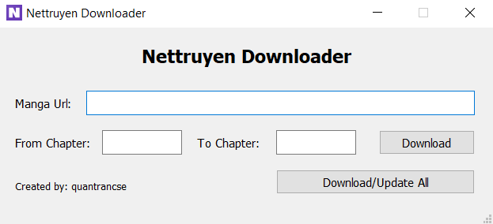

![Python Version][python-shield]
![PyQt5 Version][pyqt5-shield]
[![MIT License][license-shield]][license-url]


<!-- PROJECT LOGO -->
<br />
<p align="center">
    </img>

  <h2 align="center">NetTruyen Downloader Minimal</h2>

  <p align="center">
    Minimal version without QML of <a href=https://github.com/quantrancse/nettruyen-downloader>Nettruyen Downloader</a>
    <br />
    <br />
  </p>
</p>

<!-- ABOUT -->
## About
[Update_1] This tool is not working anymore. The raw requests to the image host have been blocked by the Cloudflare firewall. And I'm too lazy.

[Update_2] I've found a Tampermonkey script that works on different manga sites: https://github.com/lelinhtinh/Userscript/tree/master/manga_comic_downloader

Thanks to the author and use it by your own way.

---

For more infomation about the project please read in [Nettruyen Downloader](https://github.com/quantrancse/nettruyen-downloader).

<!-- GETTING STARTED -->
## Getting Started

For the ones who want to develop this project in the future or make it for other manga website.
<br />
<br />
I just only test it on Windows platform but the source code can be built to run on Mac or Linux with some modifications about the os path.

### Prerequisites

* python 3.6.8
* PyQt5
```sh
pip install pyqt5
```
* pyrcc5
* fbs or pyinstaller
```sh
pip install fbs
```
* Some IDE if needed: Qt Creator, Qt Designer

**_Notes:_** _fbs does not run with python > 3.6, so if you want to build with higher python version please use pyinstaller_

### Installation

* Clone the repo
```sh
git clone https://github.com/quantrancse/nettruyen-downloader-minimal.git
```
* Modify the source code
* Run the code
```sh
fbs run
```
* Build .exe file
```sh
fbs freeze
```

* More info about fbs: [fbs-tutorial](https://github.com/mherrmann/fbs-tutorial)


## Recommended Manga Viewer

* I have found a good image viewer application that perfectly suited for reading manga - [QuickViewer](https://kanryu.github.io/quickviewer/)
  
<!-- CONTRIBUTING -->
## Contributing

Contributions are what make the open source community such an amazing place to be learn, inspire, and create. Any contributions you make are **greatly appreciated**.

1. Fork the Project
2. Create your Feature Branch (`git checkout -b feature/AmazingFeature`)
3. Commit your Changes (`git commit -m 'Add some AmazingFeature'`)
4. Push to the Branch (`git push origin feature/AmazingFeature`)
5. Open a Pull Request


<!-- LICENSE -->
## License

Distributed under the MIT License. See [LICENSE][license-url] for more information.

<!-- CONTACT -->
## Contact

* **Author** - [@quantrancse](https://www.facebook.com/quantrancse)

<!-- ACKNOWLEDGEMENTS -->
## Acknowledgements
* [PyQt5 tutorial](https://build-system.fman.io/pyqt5-tutorial)
* [Qt Documentation](https://doc.qt.io/)
* [fbs tutorial](https://github.com/mherrmann/fbs-tutorial)

<!-- MARKDOWN LINKS & IMAGES -->
[python-shield]: https://img.shields.io/badge/python-3.6.8-brightgreen?style=flat-square
[pyqt5-shield]: https://img.shields.io/badge/PyQt5-5.14.1-blue?style=flat-square
[license-shield]: https://img.shields.io/github/license/quantrancse/nettruyen-downloader?style=flat-square
[license-url]: https://github.com/quantrancse/nettruyen-downloader-minimal/blob/master/LICENSE
